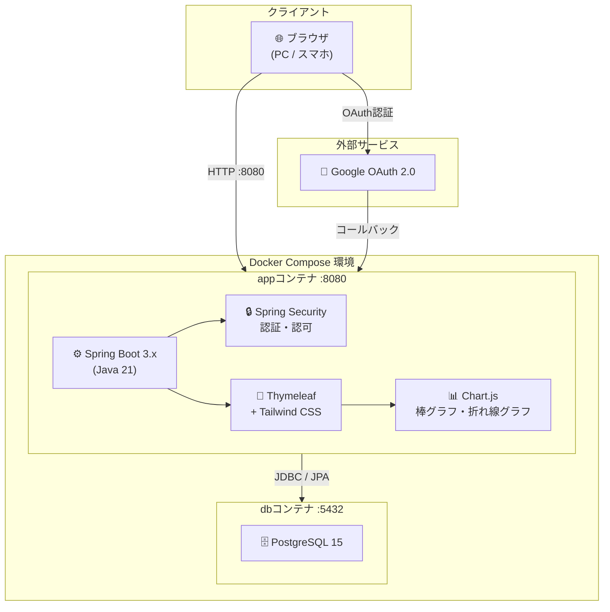
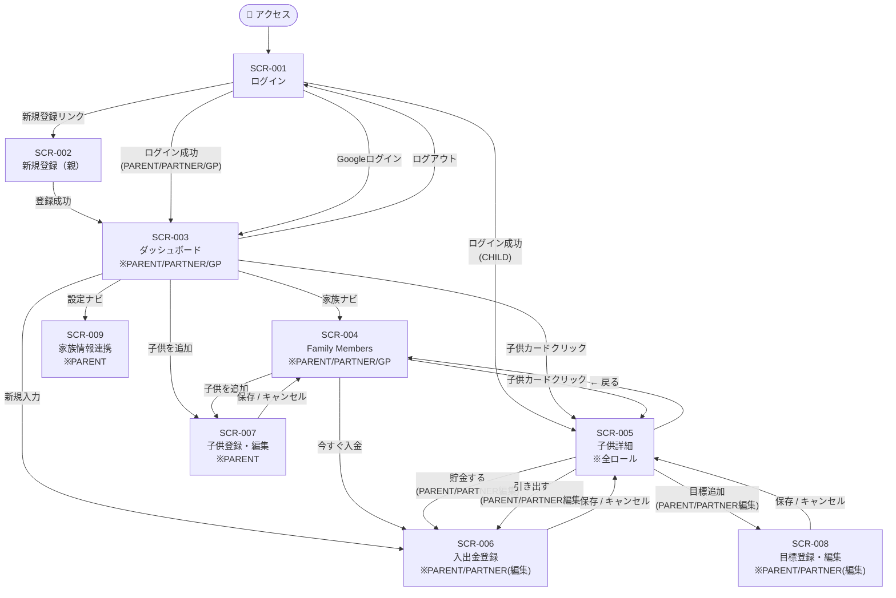
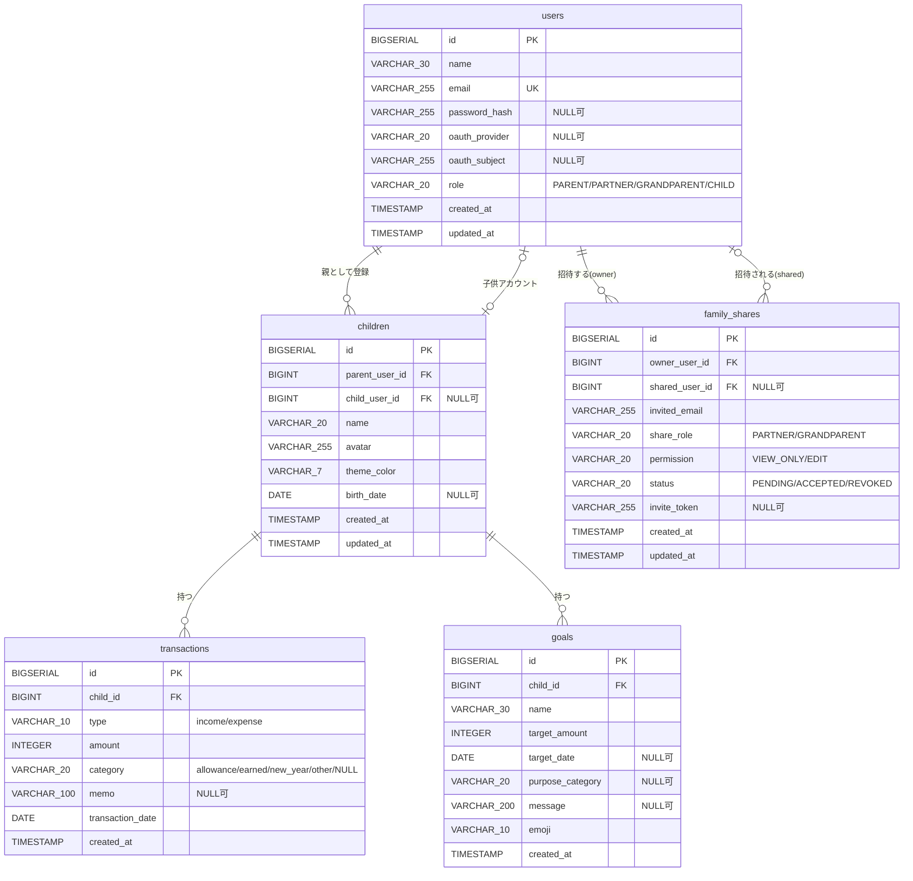

# 構成図集

**プロジェクト名：** こどちょ
**作成日：** 2026-03-28
**バージョン：** 1.2（ダッシュボード刷新・クイック操作・学年ラベルを反映）

---

## 1. システム構成図

```mermaid
graph TB
    subgraph Client["クライアント"]
        Browser["🌐 ブラウザ\n(PC / スマホ)"]
    end

    subgraph Docker["Docker Compose 環境"]
        subgraph AppContainer["appコンテナ :8080"]
            SpringBoot["⚙️ Spring Boot 3.x\n(Java 21)"]
            Security["🔒 Spring Security\n認証・認可"]
            Thymeleaf["📄 Thymeleaf\n+ Tailwind CSS"]
            ChartJS["📊 Chart.js\n棒グラフ・折れ線グラフ"]
            SpringBoot --> Security
            SpringBoot --> Thymeleaf
            Thymeleaf --> ChartJS
        end

        subgraph DBContainer["dbコンテナ :5432"]
            PostgreSQL["🗄️ PostgreSQL 15"]
        end

        AppContainer -->|"JDBC / JPA"| DBContainer
    end

    subgraph External["外部サービス"]
        Google["🔑 Google OAuth 2.0"]
    end

    Browser -->|"HTTP :8080"| AppContainer
    Browser -->|"OAuth認証"| Google
    Google -->|"コールバック"| AppContainer
```

---

## 2. 画面遷移図

```mermaid
flowchart TD
    START(["🚀 アクセス"]) --> SCR001

    SCR001["SCR-001\nログイン"]
    SCR002["SCR-002\n新規登録（親）"]
    SCR003["SCR-003\nダッシュボード\n※PARENT/PARTNER/GP"]
    SCR004["SCR-004\nFamily Members\n※PARENT/PARTNER/GP"]
    SCR005["SCR-005\n子供詳細\n※全ロール"]
    SCR006["SCR-006\n入出金登録\n※PARENT/PARTNER(編集)"]
    SCR007["SCR-007\n子供登録・編集\n※PARENT"]
    SCR008["SCR-008\n目標登録・編集\n※PARENT/PARTNER(編集)"]
    SCR009["SCR-009\n家族情報連携\n※PARENT"]

    SCR001 -->|"新規登録リンク"| SCR002
    SCR002 -->|"登録成功"| SCR003
    SCR001 -->|"ログイン成功\n(PARENT/PARTNER/GP)"| SCR003
    SCR001 -->|"ログイン成功\n(CHILD)"| SCR005
    SCR001 -->|"Googleログイン"| SCR003

    SCR003 -->|"家族ナビ"| SCR004
    SCR003 -->|"子供カードクリック"| SCR005
    SCR003 -->|"新規入力"| SCR006
    SCR003 -->|"子供を追加"| SCR007
    SCR003 -->|"設定ナビ"| SCR009
    SCR003 -->|"ログアウト"| SCR001

    SCR004 -->|"子供カードクリック"| SCR005
    SCR004 -->|"今すぐ入金"| SCR006
    SCR004 -->|"子供を追加"| SCR007

    SCR005 -->|"貯金する\n(PARENT/PARTNER編集)"| SCR006
    SCR005 -->|"引き出す\n(PARENT/PARTNER編集)"| SCR006
    SCR005 -->|"目標追加\n(PARENT/PARTNER編集)"| SCR008
    SCR005 -->|"← 戻る"| SCR004

    SCR006 -->|"保存 / キャンセル"| SCR005
    SCR007 -->|"保存 / キャンセル"| SCR004
    SCR008 -->|"保存 / キャンセル"| SCR005
```

---

## 3. DB構成図（ER図）

```mermaid
erDiagram
    users {
        BIGSERIAL id PK
        VARCHAR_30 name
        VARCHAR_255 email UK
        VARCHAR_255 password_hash "NULL可"
        VARCHAR_20 oauth_provider "NULL可"
        VARCHAR_255 oauth_subject "NULL可"
        VARCHAR_20 role "PARENT/PARTNER/GRANDPARENT/CHILD"
        TIMESTAMP created_at
        TIMESTAMP updated_at
    }

    children {
        BIGSERIAL id PK
        BIGINT parent_user_id FK
        BIGINT child_user_id FK "NULL可"
        VARCHAR_20 name
        VARCHAR_255 avatar
        VARCHAR_7 theme_color
        DATE birth_date "NULL可"
        TIMESTAMP created_at
        TIMESTAMP updated_at
    }

    transactions {
        BIGSERIAL id PK
        BIGINT child_id FK
        VARCHAR_10 type "income/expense"
        INTEGER amount
        VARCHAR_20 category "allowance/earned/new_year/other/NULL"
        VARCHAR_100 memo "NULL可"
        DATE transaction_date
        TIMESTAMP created_at
    }

    goals {
        BIGSERIAL id PK
        BIGINT child_id FK
        VARCHAR_30 name
        INTEGER target_amount
        DATE target_date "NULL可"
        VARCHAR_20 purpose_category "NULL可"
        VARCHAR_200 message "NULL可"
        VARCHAR_10 emoji
        TIMESTAMP created_at
    }

    family_shares {
        BIGSERIAL id PK
        BIGINT owner_user_id FK
        BIGINT shared_user_id FK "NULL可"
        VARCHAR_255 invited_email
        VARCHAR_20 share_role "PARTNER/GRANDPARENT"
        VARCHAR_20 permission "VIEW_ONLY/EDIT"
        VARCHAR_20 status "PENDING/ACCEPTED/REVOKED"
        VARCHAR_255 invite_token "NULL可"
        TIMESTAMP created_at
        TIMESTAMP updated_at
    }

    users ||--o{ children : "親として登録"
    users |o--o| children : "子供アカウント"
    children ||--o{ transactions : "持つ"
    children ||--o{ goals : "持つ"
    users ||--o{ family_shares : "招待する(owner)"
    users |o--o{ family_shares : "招待される(shared)"
```

---

## 4. パッケージ構成図（クラス図）

```mermaid
classDiagram
    namespace controller {
        class AuthController {
            +showLogin() String
            +showRegister() String
            +register(RegisterForm) String
            +logout() String
        }
        class DashboardController {
            +dashboard(Model) String
        }
        class ChildController {
            +family(Model) String
            +showNew() String
            +create(ChildForm) String
            +showEdit(Long) String
            +update(Long, ChildForm) String
            +delete(Long) String
        }
        class TransactionController {
            +detail(Long, String, Model) String
            +showNew(Long, String) String
            +create(Long, TransactionForm) String
            +delete(Long, Long) String
            +chartData(Long, String) ResponseEntity
        }
        class GoalController {
            +showNew(Long) String
            +create(Long, GoalForm) String
            +showEdit(Long, Long) String
            +update(Long, Long, GoalForm) String
            +delete(Long, Long) String
        }
        class FamilySharingController {
            +showSharing(Model) String
            +invite(FamilyShareInviteForm) String
            +accept(String) String
            +revoke(Long) String
            +resend(Long) String
        }
    }

    namespace service {
        class DashboardService {
            +getDashboardData(Long) DashboardViewModel
            +getFamilyTotalBalance(Long) int
            +getMonthlyGrowthRate(Long) double
            +getMonthlyBarChartData(Long) ChartDataDto
        }
        class ChildService {
            +findAllByParent(Long) List~Child~
            +findById(Long) Child
            +save(Child) void
            +delete(Long) void
            +calcBalance(Long) int
            +getGradeLabel(LocalDate) String
        }
        class TransactionService {
            +findByChildAndMonth(Long, YearMonth) List~Transaction~
            +findMonths(Long) List~YearMonth~
            +getLineChartData(Long, String) ChartDataDto
            +save(Transaction) void
            +delete(Long) void
        }
        class GoalService {
            +findByChild(Long) List~Goal~
            +save(Goal) void
            +update(Goal) void
            +delete(Long) void
            +isAchieved(Goal, int) boolean
            +getAchievementRate(Goal, int) int
        }
        class FamilySharingService {
            +getSharesByOwner(Long) List~FamilyShare~
            +invite(Long, FamilyShareInviteForm) String
            +accept(String, Long) void
            +revoke(Long) void
            +resend(Long) void
        }
    }

    namespace security {
        class SecurityConfig {
            +securityFilterChain() SecurityFilterChain
            +passwordEncoder() PasswordEncoder
        }
        class CustomUserDetailsService {
            +loadUserByUsername(String) UserDetails
        }
        class OAuth2UserService {
            +loadUser(OAuth2UserRequest) OAuth2User
        }
    }

    DashboardController --> DashboardService
    DashboardController --> ChildService
    ChildController --> ChildService
    TransactionController --> TransactionService
    TransactionController --> ChildService
    GoalController --> GoalService
    GoalController --> ChildService
    FamilySharingController --> FamilySharingService
    SecurityConfig --> CustomUserDetailsService
    SecurityConfig --> OAuth2UserService
```
